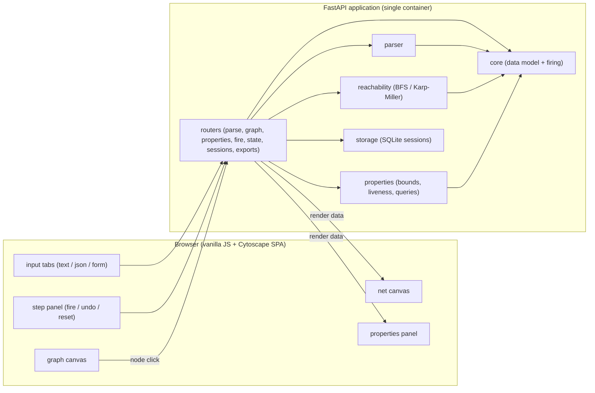
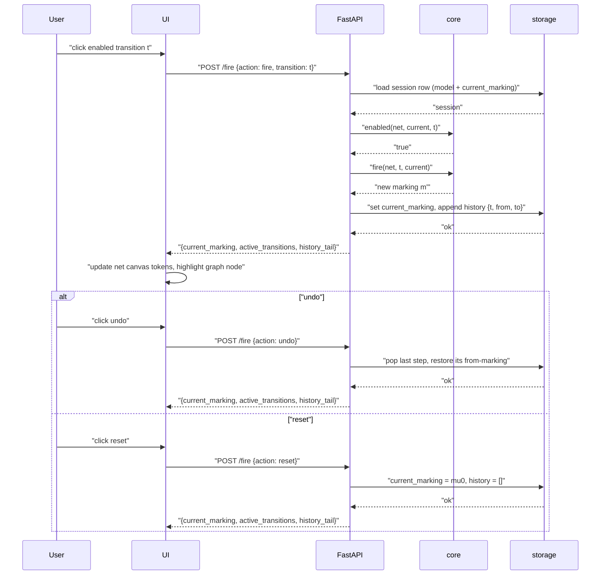

# Architecture — petri-net-web

petri-net-web is a single-container web application: a FastAPI (Python 3.12)
backend that parses Petri nets from three intake channels (raw mathematical
text, JSON, interactive form), builds the reachability graph or the Karp–Miller
coverability tree, computes the full property set (boundedness, safety,
liveness L0–L4, marking queries, deadlocks, dead transitions, home state,
deadlock-free), and serves a vanilla-JS + Cytoscape frontend from the same
process. Every analyzed net is a session persisted in SQLite (stdlib `sqlite3`,
one row per session, `$DB_PATH` on the `petri-data` volume), so history,
graphs and reports survive container restarts without recomputation (ADR-0005).
The domain package `petrinet/` is framework-free and immutable (ADR-0001);
only the API layer imports FastAPI and translates typed exceptions into HTTP
(ADR-0006).

## Components



The static frontend (no build step) is served by the same FastAPI app, so the
container exposes one port: the JSON API and the SPA files (brief §7–8).

## Data flow

1. **Parse.** `parse_text` / `parse_json` / `parse_form` normalizes the input
   to the canonical JSON model (ADR-0003) and returns an immutable `PetriNet`
   (ADR-0001). Any failure raises `ParseError`/`ValidationError` and creates
   no session (FR-001–FR-003 c3).
2. **Session.** `POST /parse` stores the model as a SQLite row — uuid4 hex
   id, `current_marking = µ0`, empty history (ADR-0005) — and returns the
   session id.
3. **Graph build.** `POST /graph` runs `reachability.build` in mode
   `auto` | `bounded` | `coverability`; the structure (smoke net: 1503 nodes /
   4983 edges, D-009) is persisted in `graph_json`.
4. **Properties report.** `POST /properties` runs `properties.analyze` over
   the stored structure, answering optional reachability/coverability
   queries; the report is persisted in `report_json`.
5. **State ops.** `POST /fire` performs `fire` / `undo` / `reset` against
   `current_marking` + `history_json` (ADR-0005); clicking a graph node issues
   a goto step (the marking must be in the stored graph, brief §8). Every op
   returns the new `current_marking`, the active transitions, and the history
   tail.
6. **Exports.** `GET .../export/report` (JSON) and `GET .../export/markings`
   (CSV: header = place names in declared order, one row per node in BFS
   discovery order, brief §7) read the stored artifacts; PNG export is
   client-side (Cytoscape, A-11).

## Step execution (sequence)



A `fire` of a disabled transition raises `TransitionNotEnabledError` → 409;
`undo` on an empty history fails the same way, and any op on a deleted
session returns the typed 404 (ADR-0005, ADR-0006).

## Error model

| Exception (`petrinet/errors.py`) | HTTP | `error.code` |
| -------------------------------- | ---- | ------------ |
| `ParseError` | 422 | `parse_failed` |
| `ValidationError` | 422 | `validation_failed` |
| `UnknownSessionError` | 404 | `unknown_session` |
| `CapExceededError` | 413 | `cap_exceeded` |
| `TransitionNotEnabledError` | 409 | `transition_not_enabled` |
| (any uncaught exception) | 500 | `internal_error` |

Rule: domain modules raise only `PetriNetError` subclasses and never import
FastAPI; the API layer registers one exception handler per class in
`create_app()` mapping the type to the status and code above, building the
body `{"error": {"code", "message", "details?"}}` (ADR-0006). No
`HTTPException` is raised in domain code.

## Module contracts

### parser (`petrinet/parser.py`)

```python
def parse_text(text: str) -> PetriNet:
    """Raw mathematical notation (FR-001). Raises ParseError(position, message), then ValidationError."""

def parse_json(payload: dict[str, object]) -> PetriNet:
    """Canonical JSON object (ADR-0003). Raises ValidationError(problems: list of {path, message})."""

def parse_form(payload: dict[str, object]) -> PetriNet:
    """Form intake normalized to the canonical JSON object. Raises ValidationError."""
```

- All three channels normalize to the one canonical JSON (ADR-0003) and share
  the same two-pass validator; equivalent descriptions produce the **same**
  `PetriNet` (FR-001–FR-003).
- `parse_text`: repetition in I/O sets counts as arc weight; a symbol not in
  P/T, a non-integer marking value, or a marking of length ≠ |P| raises
  `ParseError` with the character position (FR-001 c3).
- `parse_json`/`parse_form`: pass 1 = JSON-Schema 2020-12 skeleton, pass 2 =
  cross-field rules (arc references; `initial_marking` must cover ALL places —
  a missing place is an error, not an implicit 0; REQUIREMENTS §8.4).
- Absent top-level `inputs`/`outputs` and absent per-transition entries
  normalize to empty maps (weight-0 arcs) in every channel
  (REQUIREMENTS §8.8, ADR-0003).
- The result is the frozen `PetriNet` of ADR-0001: declared place/transition
  order, positive integer arc weights, `initial_marking` aligned to places.
- Smoke: the three fixture descriptions (REQUIREMENTS §5.1/§5.2) yield one
  net with P = p1..p6, T = t1..t5, µ0 = (7, 4, 2, 5, 4, 3).

### core (`petrinet/core.py`)

```python
Marking = tuple[int, ...]  # m[i] = tokens on places[i]; len(m) == len(net.places)

@dataclass(frozen=True)
class PetriNet:
    places: tuple[str, ...]
    transitions: tuple[str, ...]
    inputs: tuple[tuple[tuple[str, int], ...], ...]
    outputs: tuple[tuple[tuple[str, int], ...], ...]
    initial_marking: Marking

    def enabled(self, marking: Marking, t: str) -> bool:
        """True iff marking[p] >= w for every (p, w) in inputs[t]; O(|P|)."""

    def fire(self, marking: Marking, t: str) -> Marking:
        """Return marking - I(t) + O(t); raises TransitionNotEnabledError if not enabled."""

    def active(self, marking: Marking) -> list[str]:
        """Transitions enabled at marking, in declared transition order."""
```

- Semantics are exactly ADR-0001 (equivalent free functions
  `enabled(net, t, m)` / `fire(net, t, m)`); the method form is the module
  contract.
- Firing is O(|P|): one pass rebuilding a |P|-tuple; the input marking and
  the net are never mutated (immutability, frozen dataclass).
- `t` is assumed declared (guaranteed by ADR-0003 validation); a transition
  with no input arcs is enabled at every marking.
- `fire` on a disabled transition raises `TransitionNotEnabledError`
  (ADR-0006); `active` order is deterministic, so response arrays are stable.
- Smoke anchors (D-014), µ0 = (7, 4, 2, 5, 4, 3):
  `active(µ0) == ["t1", "t2", "t3", "t4", "t5"]`;
  `fire(µ0, "t1") == (5, 5, 2, 5, 4, 3)`.

### reachability (`petrinet/reachability.py`)

```python
OmegaMarking = tuple[int | None, ...]  # None = omega (ADR-0001)

@dataclass(frozen=True)
class ReachableStructure:
    kind: Literal["graph", "coverability"]
    nodes: list[tuple[str, Marking | OmegaMarking]]  # (node id, marking); nodes[0] is mu0
    edges: list[tuple[str, str, str]]                # (src_id, transition, dst_id)
    stats: dict[str, int]                            # {"nodes": N, "edges": M}

def build(net: PetriNet, mode: Literal["auto", "bounded", "coverability"] = "auto") -> ReachableStructure:
    """BFS reachability graph (auto/bounded) or Karp-Miller coverability tree; raises CapExceededError on the cap."""
```

- `nodes[0]` is always µ0; discovery order is BFS (graph) / preorder (tree);
  node id = `"n<index>"`, deterministic across runs for the same net
  (ADR-0002).
- Transitions expand in declared order, so the edge id `n<src>:t<n<dst>` is
  stable; `stats` = `{"nodes": N, "edges": M}`.
- `auto`/`bounded`: hard cap `REACH_MAX_MARKINGS` (default 50000); exceeding
  it raises `CapExceededError(limit)` → 413 with
  `details.suggestion: "coverability"` (ADR-0002, NFR-002).
- `coverability`: classical Karp–Miller with the ancestor-correction step
  (ω promotion where the candidate strictly exceeds a path node, ADR-0002);
  ω dominates naturals; the construction always terminates, and the same `cap`
  applies as a safety device against the bounded-net tree explosion (D-034).
- Smoke: `build(smoke_net, "auto")` → kind `"graph"`, 1503 nodes / 4983 edges
  (D-009); the unbounded fixture (REQUIREMENTS §5.6) terminates in
  coverability mode with a single ω node.

### properties (`petrinet/properties.py`)

```python
LivenessLevel = Literal["L0", "L1", "L3", "L4"]  # classical scale (ADR-0004); L2 never emitted on a finite graph

@dataclass(frozen=True)
class TransitionLiveness:
    occurs: bool
    level: LivenessLevel      # L0 dead / L1 occurs / L3 cycle-with-t / L4 live (strong)

@dataclass(frozen=True)
class Liveness:
    level: LivenessLevel      # net level = min over transitions (order L0<L1<L3<L4)
    transitions: dict[str, TransitionLiveness]

@dataclass(frozen=True)
class Report:
    per_place_k: dict[str, int | None]  # place -> k_p; None = unbounded (omega)
    global_k: int | None                # max of k_p; None = net unbounded
    bounded: bool                       # all places bounded (global_k is not None)
    safe: bool                          # 1-bounded (all k_p <= 1)
    liveness: Liveness
    deadlocks: list[MarkingOrOmega]  # tree labels may contain omega (None)
    dead_transitions: list[str]
    home_state: bool
    deadlock_free: bool
    approximation: Literal[None, "omega"]
    stats: dict[str, int]

def analyze(net: PetriNet, structure: ReachableStructure) -> Report:
    """Full property set over the stored structure (FR-007..FR-014)."""

def is_reachable(net: PetriNet, structure: ReachableStructure, target: Marking) -> bool | None:
    """Exact membership in the reachability graph; None on a coverability tree (undecidable in general)."""

def is_coverable(net: PetriNet, structure: ReachableStructure, target: Marking) -> bool | None:
    """True iff some structure marking m has m[p] >= target[p] for all p (omega >= any natural)."""
```

- Exact for `kind == "graph"`; for `"coverability"` structures every derived
  value carries `approximation = "omega"` (ω over-approximates, ADR-0002),
  and `is_reachable` returns `None` there — exact reachability is undecidable
  in general, the tree answers coverability instead. `is_coverable` is
  answered from either structure, with the same caveat on the tree.
- Liveness (ADR-0004, classical scale): `occurs` = enabled at some reachable
  marking; per-transition `level` = L4 if the backwards closure from the
  enablement set covers all reachable markings (strong, MSU), else L3 if some
  reachable cycle contains a t-edge (one Tarjan SCC pass shared by all t; on
  a finite graph L2 <=> L3 so L2 is never emitted), else L1 if occurs, else
  L0. Net `level` = the minimum over transitions (order L0 < L1 < L3 < L4);
  a net at L4 is deadlock-free.
- Deadlock = reachable marking at which no transition is enabled; dead
  transition = never occurs; home state = every reachable marking can reach
  µ0; deadlock-free = empty deadlock list.
- Deterministic serialization: reports and query answers are JSON with sorted
  keys; `deadlocks` in lexicographic (tuple-sorted) order, `dead_transitions`
  in declared transition order (brief §7).
- Smoke (D-010…D-013, D-035): `per_place_k` = [10, 8, 16, 29, 8, 10] over
  p1..p6, `global_k` = 29, `safe` = False, `liveness.level` = `"L1"` (all
  five transitions L1 — each occurs, but no reachable cycle contains a
  t-edge: the potential W = 3·p1 + 4·p2 + p3 + p4 + 3·p5 + 2·p6 strictly
  decreases per firing, so every run ends in a deadlock), 23 deadlocks,
  `dead_transitions` = [], `home_state` = False, `deadlock_free` = False.

## API routes

All routes speak JSON (`application/json`) except the markings export
(`text/csv`); every JSON response uses deterministic (sorted) key order
(brief §7). Errors use the body of the Error model above. `POST /goto`
accepts only a marking that is a node of the stored reachability graph;
anything else is 422 `validation_failed`.

| method | path                          | request                                                              | response (200/201)                                                       | errors                                      |
| ------ | ----------------------------- | -------------------------------------------------------------------- | ------------------------------------------------------------------------ | ------------------------------------------- |
| POST   | `/parse`                      | `{format: "text"\|"json"\|"form", payload, name?}`                   | 201 `{session_id, places, transitions, initial_marking}`                 | 422 `parse_failed`, `validation_failed`     |
| POST   | `/graph`                      | `{session_id, mode?}` (`auto`\|`bounded`\|`coverability`, default `auto`) | 200 `{kind, node_count, edge_count, capped, structure: {nodes, edges}}` (deterministic, ADR-0002 ids) | 404 `unknown_session`, 413 `cap_exceeded`   |
| POST   | `/properties`                 | `{session_id, queries?}` (`reachable_marking?`, `coverable_marking?`) | 200 full report + query answers (sample below)                          | 404 `unknown_session`, 422 `validation_failed` |
| POST   | `/fire`                       | `{session_id, action: "fire"\|"undo"\|"reset", transition?}`         | 200 `{current_marking, active_transitions, history_tail}`                | 404 `unknown_session`, 409 `transition_not_enabled` |
| POST   | `/goto`                       | `{session_id, marking: [int, ...]}`                                  | 200 `{current_marking, active_transitions, history_tail}`                | 404 `unknown_session`, 422 `validation_failed` |
| GET    | `/state/{session_id}`         | —                                                                    | 200 `{current_marking, active_transitions, history}`                     | 404 `unknown_session`                       |
| GET    | `/sessions`                   | —                                                                    | 200 array of `{session_id, name, created_at, places, transitions}`       | 500 `internal_error`                        |
| GET    | `/sessions/{id}`              | —                                                                    | 200 `{session_id, name, created_at, input_format, places, transitions, current_marking, graph_built, report_computed}` | 404 `unknown_session` |
| DELETE | `/sessions/{id}`              | —                                                                    | 204, no body                                                             | 404 `unknown_session`                       |
| GET    | `/sessions/{id}/export/report` | —                                                                  | 200 `application/json`, stored report, `Content-Disposition: attachment` | 404 `unknown_session`                       |
| GET    | `/sessions/{id}/export/markings` | —                                                                 | 200 `text/csv`, stored markings, `Content-Disposition: attachment`       | 404 `unknown_session`                       |
| GET    | `/healthz`                    | —                                                                    | 200 `{"status": "ok"}`                                                   | —                                           |

### Request/response examples

**`POST /parse`** — request (text format, smoke net, REQUIREMENTS §5.1):

```json
{
  "format": "text",
  "payload": "S = (P, T, I, O, µ),\nP = {p1, p2, p3, p4, p5, p6}, T = {t1, t2, t3, t4, t5},\nI(t1) = {p1, p1}, O(t1) = {p2},\nI(t2) = {p1, p6}, O(t2) = {p3, p3},\nI(t3) = {p2}, O(t3) = {p4, p4, p4},\nI(t4) = {p2, p3, p4, p4}, O(t4) = {p5, p6},\nI(t5) = {p5, p5}, O(t5) = {p1, p3},\nµ = (7, 4, 2, 5, 4, 3)."
}
```

Response (201):

```json
{
  "initial_marking": [7, 4, 2, 5, 4, 3],
  "places": ["p1", "p2", "p3", "p4", "p5", "p6"],
  "session_id": "00000000000000000000000000000001",
  "transitions": ["t1", "t2", "t3", "t4", "t5"]
}
```

**`POST /graph`** — request (`mode` omitted → `auto`) and response (200):

```json
{
  "session_id": "00000000000000000000000000000001"
}
```

```json
{
  "capped": false,
  "edge_count": 4983,
  "kind": "graph",
  "node_count": 1503,
  "structure": {
    "edges": [
      ["n0", "t1", "n1"],
      ["n0", "t2", "n2"],
      ["n0", "t3", "n3"]
    ],
    "nodes": [
      ["n0", [7, 4, 2, 5, 4, 3]],
      ["n1", [5, 5, 2, 5, 4, 3]],
      ["n2", [6, 4, 4, 5, 4, 2]]
    ]
  }
}
```

The example abbreviates `structure` to the first three nodes/edges; the real
response carries all 1503 nodes and 4983 edges in deterministic (BFS
discovery) order (ADR-0002). Node shape: `[id, marking-tuple]` with string id
`"n<index>"` (0-based discovery index); edge shape: `[src_id, transition,
dst_id]` (edge identifier `"n<src>:t<n<dst>"` is internal). The structure is
also stored on the session (ADR-0005) and reused by `/properties`, `/goto`,
and the CSV export.

**`POST /fire`** — request (fire `t1` at µ0) and response (200, D-014):

```json
{
  "action": "fire",
  "session_id": "00000000000000000000000000000001",
  "transition": "t1"
}
```

```json
{
  "active_transitions": ["t1", "t2", "t3", "t4", "t5"],
  "current_marking": [5, 5, 2, 5, 4, 3],
  "history_tail": [
    {
      "from": [7, 4, 2, 5, 4, 3],
      "to": [5, 5, 2, 5, 4, 3],
      "transition": "t1"
    }
  ]
}
```

**`POST /goto`** — request (switch to the first `t3` child of µ0) and
response (200); a goto is recorded in the history with `transition: null`:

```json
{
  "marking": [7, 3, 2, 8, 4, 3],
  "session_id": "00000000000000000000000000000001"
}
```

```json
{
  "active_transitions": ["t1", "t2", "t3", "t4", "t5"],
  "current_marking": [7, 3, 2, 8, 4, 3],
  "history_tail": [
    {
      "from": [7, 4, 2, 5, 4, 3],
      "to": [7, 3, 2, 8, 4, 3],
      "transition": null
    }
  ]
}
```

**Error body** — 404 for any state/session op on a deleted or unknown id:

```json
{
  "error": {
    "code": "unknown_session",
    "message": "session '000000000000000000000000000000ff' not found"
  }
}
```

## Sample properties report (smoke net)

`POST /properties` (and `GET /sessions/{id}/export/report`) for the task
fixture (REQUIREMENTS §5.1) returns this report — frozen numbers
D-009…D-013, keys sorted, `deadlocks` in lexicographic (tuple-sorted) order
(canonical order fixed by D-022). The `queries` block is present only when
the request carried queries; the example shows the FR-010 fixture answers.

```json
{
  "approximation": null,
  "bounded": true,
  "dead_transitions": [],
  "deadlock_free": false,
  "deadlocks": [
    [0, 0, 0, 0, 1, 10],
    [0, 0, 1, 5, 0, 9],
    [0, 0, 2, 17, 1, 6],
    [0, 0, 3, 7, 1, 7],
    [0, 0, 3, 22, 0, 5],
    [0, 0, 4, 12, 0, 6],
    [0, 0, 5, 2, 0, 7],
    [0, 0, 5, 24, 1, 3],
    [0, 0, 6, 14, 1, 4],
    [0, 0, 6, 29, 0, 2],
    [0, 0, 7, 4, 1, 5],
    [0, 0, 7, 19, 0, 3],
    [0, 0, 8, 9, 0, 4],
    [0, 0, 9, 21, 1, 1],
    [0, 0, 10, 11, 1, 2],
    [0, 0, 10, 26, 0, 0],
    [0, 0, 11, 1, 1, 3],
    [0, 0, 11, 16, 0, 1],
    [0, 0, 12, 6, 0, 2],
    [0, 0, 14, 8, 1, 0],
    [0, 0, 16, 3, 0, 0],
    [1, 0, 11, 18, 1, 0],
    [1, 0, 13, 13, 0, 0]
  ],
  "global_k": 29,
  "home_state": false,
  "liveness": {
    "level": "L1",
    "transitions": {
      "t1": {"level": "L1", "occurs": true},
      "t2": {"level": "L1", "occurs": true},
      "t3": {"level": "L1", "occurs": true},
      "t4": {"level": "L1", "occurs": true},
      "t5": {"level": "L1", "occurs": true}
    }
  },
  "per_place_k": {
    "p1": 10,
    "p2": 8,
    "p3": 16,
    "p4": 29,
    "p5": 8,
    "p6": 10
  },
  "queries": {
    "is_reachable": {
      "11,0,0,0,0,0": false,
      "7,4,2,5,4,3": true
    }
  },
  "safe": false,
  "stats": {
    "edge_count": 4983,
    "node_count": 1503
  }
}
```

## CSV export format

`GET /sessions/{id}/export/markings` returns `text/csv`:

- header row = place names in declared order;
- one row per reachable marking, values in declared place order, rows in BFS
  discovery order (node id order — µ0 first);
- deterministic byte-for-byte (no timestamps); smoke net = header + 1503 rows.

First rows for the smoke net (µ0, then the three first BFS children of µ0
via `t1`, `t2`, `t3` in declared transition order):

```csv
p1,p2,p3,p4,p5,p6
7,4,2,5,4,3
5,5,2,5,4,3
6,4,4,5,4,2
7,3,2,8,4,3
```

## UI contract

Screens (brief §8): input tabs (text / json / form) → analysis view (net
canvas + reachability canvas + properties panel + step panel) → session
history.

Call sequence per user action:

- tab submit → `POST /parse`, then `POST /graph`, then `POST /properties`
  (sequential, with progress states);
- reachability-graph node click → `POST /goto {session_id, marking}` (the
  marking must be a node of the stored graph);
- step / undo / reset → `POST /fire {action: fire|undo|reset}`;
- exports: PNG client-side (Cytoscape export of the active canvas), report
  JSON / markings CSV via browser download of the two export endpoints;
- session history → `GET /sessions` (selecting a session restores the stored
  model/graph/report without recomputation, FR-022).

Cytoscape data shapes:

- net canvas: node `data {kind: "place"|"transition", label, tokens}`
  (`tokens` on places only, = current marking); edge
  `data {weight, source, target}`;
- graph canvas: node `data {marking: [int, ...], deadlock: bool}`; edge
  `data {transition}`.

Loading and error states:

- any API error → toast with the error `message` (`details` included when
  present);
- graph build longer than 2 s → progress indicator until `POST /graph`
  resolves; a 413 `cap_exceeded` additionally offers the switch to
  `coverability` mode (NFR-002 c3).
